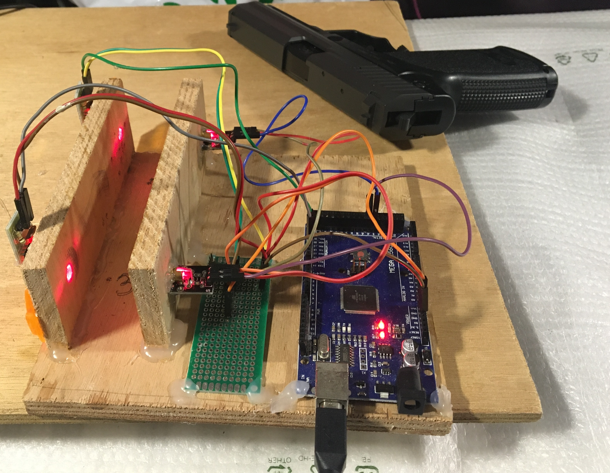
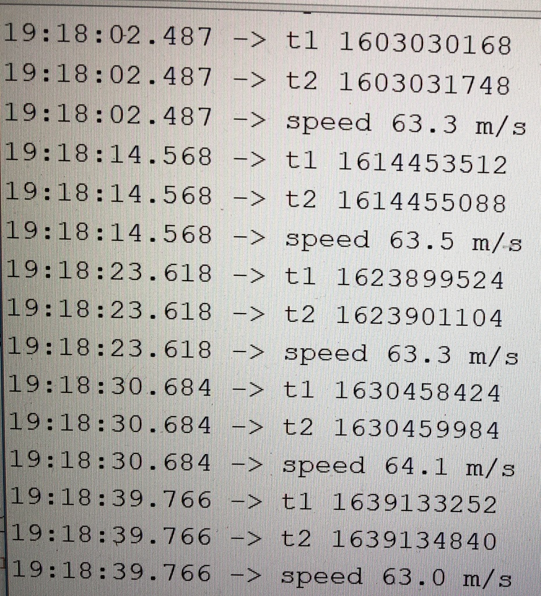

# chronoscope
Arduino-based simple chronoscope

It can be used to measure muzzle velocity of an airsoft gun. For example, I struggled to find the spec for a spring model of Tokyo Marui USP. Using this device, which is much cheaper than the commercial products, I measured it. Using 5.95mm 0.2 gramm BBs, the velocity was between 63 and 64 m/s or in kinetic energy (m x v^2)/2 = 0.4 joule. In comparison, gas models of Tokyo Marui BB guns have around 1 joule. 

